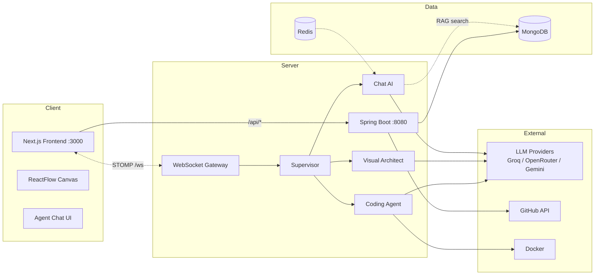

<h1 align="center">
  <br>
  CodeEvo
  <br>
</h1>

<h4 align="center">AI-powered system design platform — visually architect distributed systems, then let AI generate the code.</h4>

<p align="center">
  <a href="#features">Features</a> •
  <a href="#tech-stack">Tech Stack</a> •
  <a href="#architecture">Architecture</a> •
  <a href="#getting-started">Getting Started</a> •
  <a href="#api-reference">API</a>
</p>

<p align="center">
  <!-- [BADGE: build status — add when CI/CD exists] -->
  <!-- [BADGE: license — add after choosing a license] -->
</p>

---

## Live Demo

<!-- [SCREENSHOT HERE: Add a screenshot or GIF of the diagram canvas + agent chat side-by-side] -->

> _A screenshot of the workspace showing the ReactFlow diagram canvas on the left, the AI agent chat on the right, and the code viewer at the bottom._

---

## What It Does

CodeEvo lets developers **visually design distributed architectures** using a drag-and-drop diagram canvas, then uses a **4-agent AI system** to automatically generate, modify, and evolve production-ready Spring Boot code — while keeping a Git repository fully synchronized via GitHub.

**The core loop:**
1. Design your system on the canvas (services, databases, queues, API gateways)
2. Chat with the AI: "Add a payment service" or "Implement the auth module"
3. The Visual Architect agent updates the diagram in real-time
4. You review and approve the architecture
5. The Coding Agent generates the actual code files
6. Push to GitHub with one click

---

## Features

- **Visual System Design** — Drag-and-drop canvas with ReactFlow for designing distributed architectures (services, databases, queues, API gateways)
- **Quad-Agent AI System** — 4 specialized agents (Supervisor, Chat AI, Visual Architect, Coding Agent) orchestrated by a deterministic state machine
- **Real-time Agent Communication** — STOMP over WebSocket for live agent thoughts, progress, tool calls, and graph updates
- **Human-in-the-Loop Approvals** — Review diffs before code is written; approve or reject architecture changes before code generation
- **Docker Sandbox Execution** — Generated code builds and runs in isolated Docker containers with live log streaming
- **GitHub Integration** — OAuth login, repo linking, one-click push, commit browsing, and webhook support
- **RAG-Powered Code Search** — Semantic search over project code using dense vector embeddings
- **Conversation Memory** — Sliding-window + LLM summarization for context-aware multi-turn conversations
- **JWT Authentication** — Secure auth with access/refresh tokens, OAuth2 (Google/GitHub), and Argon2 password hashing
- **Project History** — Full version history with diagram snapshots and restore capability

---

## Tech Stack

| Category | Technology | Why |
|----------|-----------|-----|
| **Frontend** | Next.js 16 (App Router) | Built-in API proxy keeps cookies same-origin; file-based routing |
| **UI Framework** | React 19 | Component-based UI for the interactive diagram canvas and agent chat |
| **Styling** | Tailwind CSS v4 + shadcn/ui | 54 composable components; dark theme via CSS variables; no config file |
| **Diagram Canvas** | ReactFlow | MIT-licensed, native React support, programmatic graph updates from AI agents |
| **State Management** | Zustand | ~1KB, zero boilerplate, built-in localStorage persistence |
| **Backend** | Spring Boot 3.2.5 (Java 21) | Auto-config for MongoDB, Redis, RabbitMQ, WebSocket, OAuth2 |
| **Database** | MongoDB | Flexible document model for variable diagram JSON; no migrations |
| **Cache / Session** | Redis | Sub-ms reads for agent conversation memory; TTL-based expiry |
| **Message Queue** | RabbitMQ | Event bus for user registration events |
| **Real-time** | STOMP over SockJS | Pub/sub semantics for agent events; fallback transport support |
| **AI / LLM** | Custom OpenAI-compatible client | Works with Groq, OpenRouter, Gemini, Ollama, OpenAI — zero code changes to swap |
| **RAG** | Cosine similarity + embeddings | Semantic code search without external vector database |
| **Auth** | JWT + OAuth2 | Short-lived access tokens (30min) + HttpOnly refresh cookies (7 days) |
| **Containerization** | Docker Compose | Isolated sandbox for generated code with live preview |
| **Build** | Maven (backend) + npm (frontend) | Standard tooling; Maven Wrapper ensures consistent builds |

---

## Architecture

### System Overview



### Agent Interaction Flow

This is the core user journey: a user sends a message, the Chat AI routes it, the Visual Architect designs the architecture, the user approves, and the Coding Agent generates the code.

```mermaid
sequenceDiagram
    participant U as User
    participant WS as WebSocket
    participant S as Supervisor
    participant C as Chat AI
    participant A as Visual Architect
    participant D as Coding Agent
    participant LLM as LLM API

    U->>WS: "Add a payment service"
    WS->>S: handleUserMessage()
    S->>C: run(message)

    rect rgb(30, 40, 60)
    Note over C: Route to Architect
    C->>LLM: chat(scratchpad, tools)
    LLM-->>C: delegate_to_visual_architect
    C->>S: onArchitectTask(archTask)
    end

    rect rgb(40, 30, 60)
    Note over A: Design Architecture
    S->>A: run(archTask)
    A->>LLM: chat(scratchpad, tools)
    LLM-->>A: render_reactflow_graph
    A->>WS: GRAPH_UPDATE (nodes/edges)
    LLM-->>A: request_code_generation_permission
    A->>WS: PERMISSION_REQ
    end

    Note over U: User reviews diagram, clicks Approve

    U->>WS: /app/agent-feedback {APPROVE}
    WS->>S: handleUserFeedback()

    rect rgb(30, 50, 40)
    Note over D: Generate Code
    S->>D: run(codingTask)
    D->>LLM: chat(scratchpad, tools)
    LLM-->>D: create_file(pom.xml)
    D->>WS: DIFF_READY
    Note over U: User reviews diff
    U->>WS: APPROVE
    D->>LLM: chat继续
    LLM-->>D: end_turn
    D->>S: CodingTaskResult(success)
    end

    S->>C: summarizeLastTask()
    C->>WS: MESSAGE: "5 files created"
    C->>WS: TASK_COMPLETE
```



---

## Folder Structure

```
CodeEvo/
├── Backend/
│   └── src/main/java/com/codeevo/
│       ├── auth_user/        # JWT auth, OAuth2, user management, SecurityConfig
│       ├── project/          # Project CRUD, diagrams, code files, history, Docker sandbox
│       ├── agent/            # Quad-Agent AI: supervisor, chat, architect, coding, RAG, memory
│       └── github/           # GitHub OAuth, repos, commits, push, webhooks
│
├── Frontend/
│   ├── app/                  # App Router pages: auth, dashboard, projects, [project], git, settings
│   ├── components/           # Feature components + ui/ (54 shadcn/ui components)
│   ├── lib/                  # api.ts, stores (zustand), websocket.ts (STOMP)
│   └── styles/               # globals.css (Tailwind v4, theme variables)
│
└── Logo/                     # Brand assets
```

---

## Getting Started

### Prerequisites

- **Java 21** (JDK, not JRE)
- **Node.js 18+** and npm
- **Docker** and Docker Compose
- **MongoDB**, **Redis**, and **RabbitMQ** running locally

### 1. Start Infrastructure

```bash
cd Backend

# Start MongoDB + RabbitMQ
docker compose up -d

# Start Redis (not in docker-compose — must run separately)
docker run -d --name codeevo-redis -p 6379:6379 redis:7-alpine
```

### 2. Configure Backend

Copy and edit the application properties with your API keys:

```bash
# The real config file is at Backend/src/main/resources/application.properties
# It contains API keys — do not commit it (it's gitignored)
```

Required configuration:
- **LLM API key** — for at least one provider (OpenRouter, Groq, Gemini, etc.)
- **GitHub OAuth credentials** — client ID and secret for GitHub integration
- **Google OAuth credentials** — optional, for Google login

### 3. Run Backend

```bash
cd Backend
# Windows
.\mvnw.cmd spring-boot:run

# macOS/Linux
./mvnw spring-boot:run
```

Backend runs on `http://localhost:8080`. Swagger UI at `http://localhost:8080/swagger-ui.html`.

### 4. Run Frontend

```bash
cd Frontend
npm install
npm run dev
```

Frontend runs on `http://localhost:3000` and proxies `/api/*` to the backend.

### 5. Open

Navigate to `http://localhost:3000`, create an account, and start designing.

### Testing

```bash
# Backend — compiles and runs integration tests
cd Backend
.\mvnw.cmd compile

# Frontend — linting
cd Frontend
npm run lint

# Type checking (no built-in script)
cd Frontend
npx tsc --noEmit
```

---

## API Reference

<details>
<summary><strong>Auth</strong> (4 endpoints)</summary>

| Method | Endpoint | Purpose |
|--------|----------|---------|
| POST | `/api/auth/register` | Create account |
| POST | `/api/auth/login` | Sign in (returns JWT + sets refresh cookie) |
| POST | `/api/auth/refresh` | Refresh access token |
| POST | `/api/auth/logout` | Sign out |

</details>

<details>
<summary><strong>Users</strong> (6 endpoints)</summary>

| Method | Endpoint | Purpose |
|--------|----------|---------|
| PUT | `/api/users/name` | Update display name |
| PUT | `/api/users/email` | Update email |
| PUT | `/api/users/password` | Change password |
| POST | `/api/users/avatar` | Upload avatar (2MB max) |
| DELETE | `/api/users/avatar` | Remove avatar |
| GET | `/api/users/avatar/{filename}` | Get avatar image |

</details>

<details>
<summary><strong>Projects</strong> (8 endpoints)</summary>

| Method | Endpoint | Purpose |
|--------|----------|---------|
| POST | `/api/projects` | Create project |
| GET | `/api/projects` | List projects (paginated) |
| GET | `/api/projects/recent` | Get recent projects |
| GET | `/api/projects/stats` | Dashboard statistics |
| GET | `/api/projects/{id}` | Get project detail |
| PUT | `/api/projects/{id}` | Update project |
| PUT | `/api/projects/{id}/diagram` | Save diagram JSON |
| DELETE | `/api/projects/{id}` | Delete project |

</details>

<details>
<summary><strong>Project Code</strong> (7 endpoints)</summary>

| Method | Endpoint | Purpose |
|--------|----------|---------|
| POST | `/api/projects/{id}/code` | Create/update a code file |
| POST | `/api/projects/{id}/code/bulk` | Bulk upsert files |
| GET | `/api/projects/{id}/code` | List all code files |
| GET | `/api/projects/{id}/code/tree` | Get hierarchical file tree |
| DELETE | `/api/projects/{id}/code/{codeId}` | Delete a file |
| DELETE | `/api/projects/{id}/code` | Delete all files |
| GET | `/api/projects/{id}/code/download` | Download as ZIP |

</details>

<details>
<summary><strong>Project History</strong> (3 endpoints)</summary>

| Method | Endpoint | Purpose |
|--------|----------|---------|
| GET | `/api/projects/{id}/history` | List history (paginated) |
| GET | `/api/projects/{id}/history/{hid}` | Get history entry with snapshot |
| POST | `/api/projects/{id}/history/{hid}/restore` | Restore diagram to snapshot |

</details>

<details>
<summary><strong>Docker Sandbox</strong> (6 endpoints)</summary>

| Method | Endpoint | Purpose |
|--------|----------|---------|
| POST | `/api/projects/{id}/docker/start` | Build and start container |
| POST | `/api/projects/{id}/docker/stop` | Stop container |
| POST | `/api/projects/{id}/docker/restart` | Rebuild from scratch |
| GET | `/api/projects/{id}/docker/status` | Get container status |
| GET | `/api/projects/{id}/docker/endpoints` | Discover sandbox API endpoints |
| * | `/api/projects/{id}/docker/proxy/**` | Proxy requests to sandbox |

</details>

<details>
<summary><strong>GitHub Integration</strong> (16 endpoints)</summary>

| Method | Endpoint | Purpose |
|--------|----------|---------|
| GET | `/api/github/auth/login` | Start OAuth flow |
| POST | `/api/github/auth/callback` | Handle OAuth callback |
| GET | `/api/github/auth/status` | Check connection status |
| POST | `/api/github/auth/disconnect` | Disconnect GitHub |
| POST | `/api/github/auth/store` | Store access token |
| GET | `/api/github/repos` | List user's repos |
| GET | `/api/github/repos/{o}/{r}/branches` | List branches |
| POST | `/api/github/repos/link` | Link project to repo |
| POST | `/api/github/repos/unlink` | Unlink project |
| GET | `/api/github/repos/link/{pid}` | Get linked repo |
| GET | `/api/github/repos/linked` | List all linked repos |
| GET | `/api/github/repos/{o}/{r}/contents/{path}` | Get file content |
| GET | `/api/github/commits/{pid}` | List commits |
| GET | `/api/github/commits/{pid}/detail/{sha}` | Get commit detail |
| POST | `/api/github/push/{pid}` | Push code to GitHub |
| GET | `/api/github/push/diff/{pid}` | Get sync diff |

</details>

<details>
<summary><strong>RAG / Embeddings</strong> (4 endpoints)</summary>

| Method | Endpoint | Purpose |
|--------|----------|---------|
| POST | `/api/rag/{pid}/index` | Trigger code indexing |
| GET | `/api/rag/{pid}/status` | Get index status |
| POST | `/api/rag/{pid}/search` | Semantic code search |
| GET | `/api/rag/{pid}/chunks` | List indexed chunks |

</details>

<details>
<summary><strong>WebSocket</strong> (STOMP)</summary>

| Destination | Direction | Purpose |
|-------------|-----------|---------|
| `/app/user-input` | Client → Server | Send user message to agent |
| `/app/agent-feedback` | Client → Server | Approve/reject/modify agent actions |
| `/topic/session/{id}/events` | Server → Client | Agent thoughts, progress, messages |
| `/topic/session/{id}/diffs` | Server → Client | File diff payloads |
| `/topic/session/{id}/graph` | Server → Client | ReactFlow graph updates |

</details>

---

## Tech Decisions

- **Monolith over microservices** — The AI agents communicate via in-process method calls through the Supervisor, not network requests. The diagram canvas lets users *design* microservices, but the generated code runs as a single Spring Boot monolith in a Docker sandbox.
- **Custom LLM client over LangChain4j** — A single 216-line OkHttp client handles all 6 LLM providers (Groq, OpenRouter, Gemini, Ollama, OpenAI, OpenCode Zen) via their shared OpenAI-compatible `/v1/chat/completions` API. Zero model names are hardcoded in Java — swap providers by changing 4 properties.
- **MongoDB over PostgreSQL** — Diagram JSON payloads can be 5MB+ of ReactFlow nodes/edges. MongoDB stores these as native documents with zero transformation; PostgreSQL would require JSONB columns or complex joins.
- **Redis for agent memory, not MongoDB** — The agentic loop reads conversation history before every LLM call (~0.1ms in Redis vs ~2ms in MongoDB). Over a 10-iteration task, that latency compounds.
- **Deterministic Supervisor, not LLM-routed** — The Supervisor is a state machine that always routes to Chat AI first. This eliminates routing non-determinism while keeping intelligent delegation inside the Chat AI agent.

---

## Known Limitations

- No CI/CD pipeline (no `.github/workflows/`)
- No test suite (test dependencies exist but no test files)
- `application.properties` contains committed API keys (should use environment variables in production)
- Redis is not in `docker-compose.yml` — must be started separately
- TypeScript errors are invisible in `next build` (`ignoreBuildErrors: true`) — run `npx tsc --noEmit` manually

---

<!-- ## License

<!-- [Choose a license: MIT, Apache 2.0, or proprietary — uncomment and add the file] -->
<!-- -->

---

<p align="center">
  Built with Spring Boot, React, and a lot of LLM API calls.
</p>
